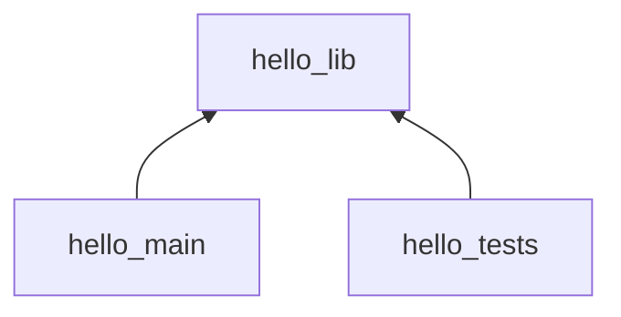

# DevOps recruitment task

TLDR: The task is at the bottom of this README

### Repository overview

A simple C++ project implementing and testing hello world application.
It has CMake buildsystem.

Development requirements:
* `cmake>=3.12`
* `c++20 toolchain - gcc or clang`

Target structure:


`hello_lib` is a library providing function returning hello world text.
`hello_tests` is a testing executable. `hello_main` is the main, deployable executable.

You can build the project with:

```shell
cmake -DCMAKE_BUILD_TYPE=Debug -S . -B build_dir # configure the build
cmake --build build_dir # run the build
( cd build_dir && ctest . )
```

### TODO (the actual task for You)

- [x] Prepare the project source code
- [ ] Write a Dockerfile containerizing the `hello_main` app
- [ ] Write a GitHub workflow testing the project and building deployable docker image
  - [ ] Build application in Release and Debug mode
  - [ ] Build and push image to github registry only when tag is pushed


